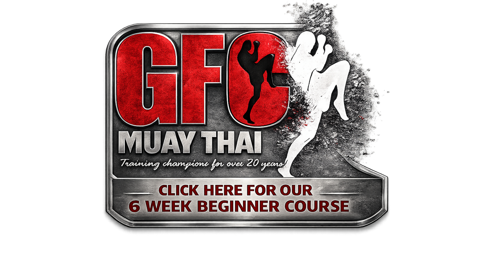
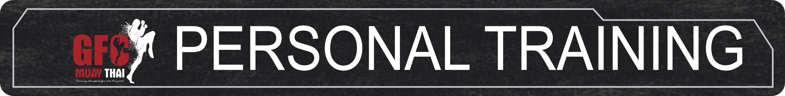
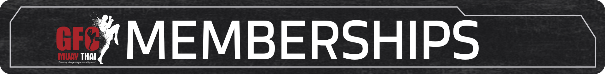

  
Bury's Number One  
Muay Thai Gym

  
Bury's Number One  
Muay Thai Gym

Muay Thai classes for all ages

Muay Thai classes for all ages

Book Your Trial Muay Thai Session Now

Book Your Trial Muay Thai Session Now

We have classes for all age groups

# 

 

 

 

 

  
Our classes are split into Junior, Teen and Adult classes: Beginners and Intermediate 

 

Beginners are allowed the time to learn properly while the more experianced brush up on their basics. And as you progress, you can join in our Intermediate classes and look to start sparring/competing. 

 

Not everyone competes, in fact the majority of people train just for the fun of learning Muay Thai.  

It’s a great way to get fit and is one of the few sports that will work on the 3 types of fitness, stamina, strength and suppleness.

Its also not a male dominated sport as our high level of success of female competitors demonstrates.

 

**GFC MEMBERSHIP PACKAGES**

 

JUNIOR UNLIMITED: £45 P/M

 

ADULT BASIC - £35 P/M

\*ONE SESION PER WEEK\*

 

ADULT STANDARD: £50 P/M

\*2 SESSIONS PER WEEK\*

 

ADULT UNLIMITED: £65 P/M

 

DROP IN PRICES: ADULTS £10 PER CLASS // JUNIORS £6 PER CLASS  
 

Book Your Trial Muay Thai Session Now

Book Your Trial Muay Thai Session Now

What other say about us

Absolutely class gym, provides all equipment, top notch trainers with over 30 years of experience, very welcoming and friendly. Nothing else you can ask for really.

Angello Mtambo

Great instructors, great people. Perfect if you want to learn a new martial art and get fit. Couldn’t recommend more. 3

Ben Featherstone

Great gym has good equipment amazing coaches and is very welcoming

Seth Booysen

Brilliant gym if you are looking to learn a new marital art. Everything from beginners to elite fighters. Very knowledgeable, experienced instructors. Highly recommended. Very Clean and has air conditioning unlike a lot of other Muay Thai gyms 🙌🏻

Nathan Potts

Best Muay Thai gym about 100% great for all levels from complete beginners to professional fighters 💯 highly recommended.

Jamie Benn

Great gym, so much to learn and perfect place to learn muay thai.

Hassan

I’ve only been for a month , I can safely say the team at GFC are dedicated to teach beginners/intermediate/advanced fighters . I had no knowledge of Muay Thai & after going for a month I feel much more confident knowing how to throw punches/kicks , how to block & clinch IF needed in self defence 💪🏼 1-1s are also available which is sick! 🔥

Imran Mejri

My 11 year old daughter has just completed 3 days away on a school trip, being set challenges every day. GFC built her confidence. Thank you Darren & Luke

Jo Booysen

Brilliant gym for kids and adults , very professional tuition from Luke and Darren. Muay Thai is a fantastic sport for everyone and the gym has produced some of the top U.K. fighters over the years . You’ll be in good hands whatever age and experience you have . It’s such a friendly environment with no egos

Alan Chadwick

Been coming here since 2017. Now become my second home training with everyone feels like a family with coaches that push you hard and give you all the advice you need. Training at GFC helped me massively outside the gym with confidence, patience and discipline. 100% recommend to anyone of any level. The beginners classes are a great way to start.

Daniel Oxley

<a href="reviews.html" class="btn btn-dark text-uppercase">View all</a>

Book Your Trial Muay Thai Session Now

Book Your Trial Muay Thai Session Now

